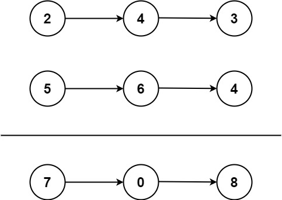
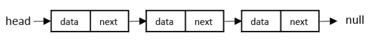
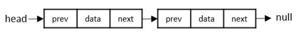
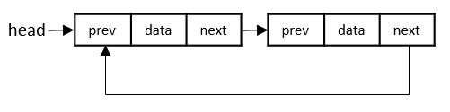

### 02. Add two numbers
You are given two non-empty linked lists representing two non-negative integers. The digits are stored in reverse order, and each of their nodes contains a single digit. Add the two numbers and return the sum as a linked list.

You may assume the two numbers do not contain any leading zero, except the number 0 itself.

 

Example 1:

Input: `l1 = [2,4,3], l2 = [5,6,4]`
Output: `[7,0,8]`
Explanation: 342 + 465 = 807.

Example 2:

Input: `l1 = [0], l2 = [0]`
Output: `[0]`

Example 3:

Input: `l1 = [9,9,9,9,9,9,9], l2 = [9,9,9,9]`
Output: `[8,9,9,9,0,0,0,1]`
 

Constraints:

The number of nodes in each linked list is in the range `[1, 100].`
`0 <= Node.val <= 9`
It is guaranteed that the list represents a number that does not have leading zeros.

### Linked List
- A linked list consists of nodes with some sort of data, and a pointer, or link, to the next node.
- **Benefits** of using Linked List:
    - Nodes are stored **wherever there is free space in memory**, the nodes do not have to be stored contiguously right after each other like elements are stored in arrays.
    - when adding or removing nodes, the rest of the nodes in the list do **NOT** have to be shifted. (UNLIKE arrays)
- The first node in a linked list is called the **"Head"**, and the last node is called the **"Tail"**. Every node consists of data which holds the **actual data (value)** associated with the node and a next pointer which **holds the memory address of the next node** in the linked list. The last node is called the tail node in the list which points to **null** indicating the end of the list.

- Types of Linked List
    1. Singly Linked Lists
    - Singly linked lists contain **two "buckets"** in one node; one bucket holds the **data** and the other bucket holds the address of the **next** node of the list. Traversals can be done **in one direction only** as there is only a single link between two nodes of the same list.
    
    2. Doubly Linked Lists
    - Doubly Linked Lists contain **three "buckets"** in one node; one bucket holds the **data** and the other buckets hold the addresses of the **previous** and **next** nodes in the list. The list is traversed **twice** as the nodes in the list are connected to each other **from both sides**.
    
    3. Circular Linked Lists
    - Circular linked lists can exist in both singly linked list and doubly linked list. Since the last node and the first node of the circular linked list are connected, the traversal in this linked list will go on forever until it is broken.
    

### Solution Explanation
- Flow: 
    - loop through both list 1 `l1` and list 2 `l2` 
    - calculate the sum of current node of list 1 , current node of list 2, and carry (if exists) 
    - calculate carry `carry = total / 10` 
    - calculate the new digit to add to the `current` list `new_digit = total % 10`
    - create a new node `ListNode(new_digit)` and attach it to `current.next` (for python and java)
- **NOTE**
    - In Java, there're **NO** pointers because Java handles the memory addresses for us
    - In Java and C++, the division is `/` because we have to declare the data type and it will force the result of `int total` to integer. Whereas, Python doesn't have type declarations, hence use `//` to return the integer results.

